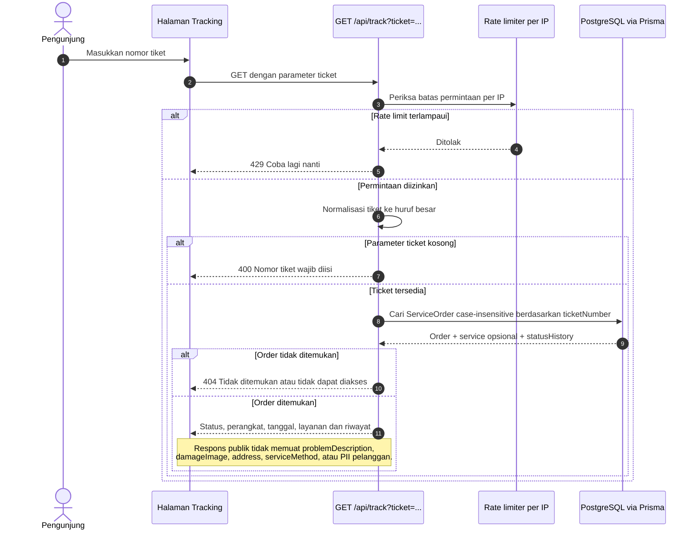

# 3. Customer Melacak Service Order

Status: final, berdasarkan audit source di `C:\laragon1\www\projek_rpl`.

```mermaid
sequenceDiagram
    autonumber
    actor C as Pengunjung
    participant UI as Halaman Tracking
    participant API as GET /api/track?ticket=...
    participant RL as Rate limiter per IP
    participant DB as PostgreSQL via Prisma

    C->>UI: Masukkan nomor tiket
    UI->>API: GET dengan parameter ticket
    API->>RL: Periksa batas permintaan per IP
    alt Rate limit terlampaui
        RL-->>API: Ditolak
        API-->>UI: 429 Coba lagi nanti
    else Permintaan diizinkan
        API->>API: Normalisasi tiket ke huruf besar
        alt Parameter ticket kosong
            API-->>UI: 400 Nomor tiket wajib diisi
        else Ticket tersedia
            API->>DB: Cari ServiceOrder case-insensitive berdasarkan ticketNumber
            DB-->>API: Order + service opsional + statusHistory
            alt Order tidak ditemukan
                API-->>UI: 404 Tidak ditemukan atau tidak dapat diakses
            else Order ditemukan
                API-->>UI: Status, perangkat, tanggal, layanan dan riwayat
                Note over API,UI: Respons publik tidak memuat problemDescription,<br/>damageImage, address, serviceMethod, atau PII pelanggan.
            end
        end
    end
```
