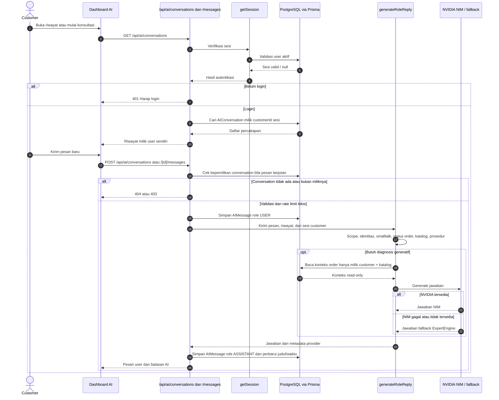

# 4. Customer Berkonsultasi dengan AI Miko

Status: final, berdasarkan audit source di `C:\laragon1\www\projek_rpl`.

```mermaid
sequenceDiagram
    autonumber
    actor C as Customer
    participant UI as Dashboard AI
    participant API as /api/ai/conversations dan /messages
    participant Auth as getSession
    participant DB as PostgreSQL via Prisma
    participant Pipe as generateRoleReply
    participant Provider as NVIDIA NIM / fallback

    C->>UI: Buka riwayat atau mulai konsultasi
    UI->>API: GET /api/ai/conversations
    API->>Auth: Verifikasi sesi
    Auth->>DB: Validasi user aktif
    DB-->>Auth: Sesi valid / null
    Auth-->>API: Hasil autentikasi
    alt Belum login
        API-->>UI: 401 Harap login
    else Login
        API->>DB: Cari AIConversation milik customerId sesi
        DB-->>API: Daftar percakapan
        API-->>UI: Riwayat milik user sendiri
        C->>UI: Kirim pesan baru
        UI->>API: POST /api/ai/conversations atau /[id]/messages
        API->>DB: Cek kepemilikan conversation bila pesan lanjutan
        alt Conversation tidak ada atau bukan miliknya
            API-->>UI: 404 atau 403
        else Validasi dan rate limit lolos
            API->>DB: Simpan AIMessage role USER
            API->>Pipe: Kirim pesan, riwayat, dan sesi customer
            Pipe->>Pipe: Scope, identitas, smalltalk, status order, katalog, prosedur
            opt Butuh diagnosis generatif
                Pipe->>DB: Baca konteks order hanya milik customer + katalog
                DB-->>Pipe: Konteks read-only
                Pipe->>Provider: Generate jawaban
                alt NVIDIA tersedia
                    Provider-->>Pipe: Jawaban NIM
                else NIM gagal atau tidak tersedia
                    Provider-->>Pipe: Jawaban fallback ExpertEngine
                end
            end
            Pipe-->>API: Jawaban dan metadata provider
            API->>DB: Simpan AIMessage role ASSISTANT dan perbarui judul/waktu
            API-->>UI: Pesan user dan balasan AI
        end
    end
```
