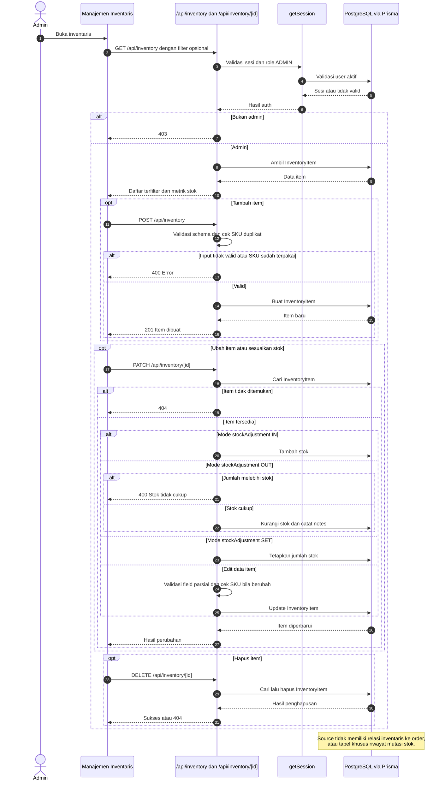

# 6. Admin Mengelola Inventaris

Status: final, berdasarkan audit source di `C:\laragon1\www\projek_rpl`.

```mermaid
sequenceDiagram
    autonumber
    actor A as Admin
    participant UI as Manajemen Inventaris
    participant API as /api/inventory dan /api/inventory/[id]
    participant Auth as getSession
    participant DB as PostgreSQL via Prisma

    A->>UI: Buka inventaris
    UI->>API: GET /api/inventory dengan filter opsional
    API->>Auth: Validasi sesi dan role ADMIN
    Auth->>DB: Validasi user aktif
    DB-->>Auth: Sesi atau tidak valid
    Auth-->>API: Hasil auth
    alt Bukan admin
        API-->>UI: 403
    else Admin
        API->>DB: Ambil InventoryItem
        DB-->>API: Data item
        API-->>UI: Daftar terfilter dan metrik stok

        opt Tambah item
            UI->>API: POST /api/inventory
            API->>API: Validasi schema dan cek SKU duplikat
            alt Input tidak valid atau SKU sudah terpakai
                API-->>UI: 400 Error
            else Valid
                API->>DB: Buat InventoryItem
                DB-->>API: Item baru
                API-->>UI: 201 Item dibuat
            end
        end

        opt Ubah item atau sesuaikan stok
            UI->>API: PATCH /api/inventory/[id]
            API->>DB: Cari InventoryItem
            alt Item tidak ditemukan
                API-->>UI: 404
            else Item tersedia
                alt Mode stockAdjustment IN
                    API->>DB: Tambah stok
                else Mode stockAdjustment OUT
                    alt Jumlah melebihi stok
                        API-->>UI: 400 Stok tidak cukup
                    else Stok cukup
                        API->>DB: Kurangi stok dan catat notes
                    end
                else Mode stockAdjustment SET
                    API->>DB: Tetapkan jumlah stok
                else Edit data item
                    API->>API: Validasi field parsial dan cek SKU bila berubah
                    API->>DB: Update InventoryItem
                end
                DB-->>API: Item diperbarui
                API-->>UI: Hasil perubahan
            end
        end

        opt Hapus item
            UI->>API: DELETE /api/inventory/[id]
            API->>DB: Cari lalu hapus InventoryItem
            DB-->>API: Hasil penghapusan
            API-->>UI: Sukses atau 404
        end
    end
    Note over DB: Source tidak memiliki relasi inventaris ke order,<br/>atau tabel khusus riwayat mutasi stok.
```
