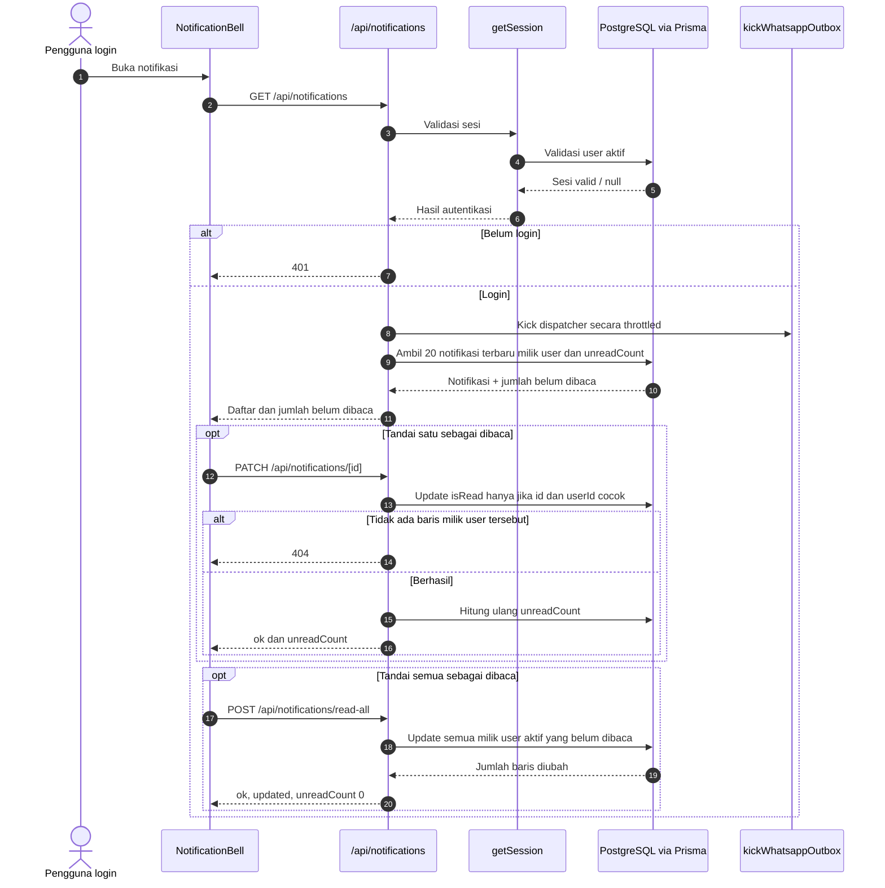

# 7. Pengguna Mengelola Notifikasi

Status: final, berdasarkan audit source di `C:\laragon1\www\projek_rpl`.

```mermaid
sequenceDiagram
    autonumber
    actor U as Pengguna login
    participant UI as NotificationBell
    participant API as /api/notifications
    participant Auth as getSession
    participant DB as PostgreSQL via Prisma
    participant WA as kickWhatsappOutbox

    U->>UI: Buka notifikasi
    UI->>API: GET /api/notifications
    API->>Auth: Validasi sesi
    Auth->>DB: Validasi user aktif
    DB-->>Auth: Sesi valid / null
    Auth-->>API: Hasil autentikasi
    alt Belum login
        API-->>UI: 401
    else Login
        API->>WA: Kick dispatcher secara throttled
        API->>DB: Ambil 20 notifikasi terbaru milik user dan unreadCount
        DB-->>API: Notifikasi + jumlah belum dibaca
        API-->>UI: Daftar dan jumlah belum dibaca
        opt Tandai satu sebagai dibaca
            UI->>API: PATCH /api/notifications/[id]
            API->>DB: Update isRead hanya jika id dan userId cocok
            alt Tidak ada baris milik user tersebut
                API-->>UI: 404
            else Berhasil
                API->>DB: Hitung ulang unreadCount
                API-->>UI: ok dan unreadCount
            end
        end
        opt Tandai semua sebagai dibaca
            UI->>API: POST /api/notifications/read-all
            API->>DB: Update semua milik user aktif yang belum dibaca
            DB-->>API: Jumlah baris diubah
            API-->>UI: ok, updated, unreadCount 0
        end
    end
```
