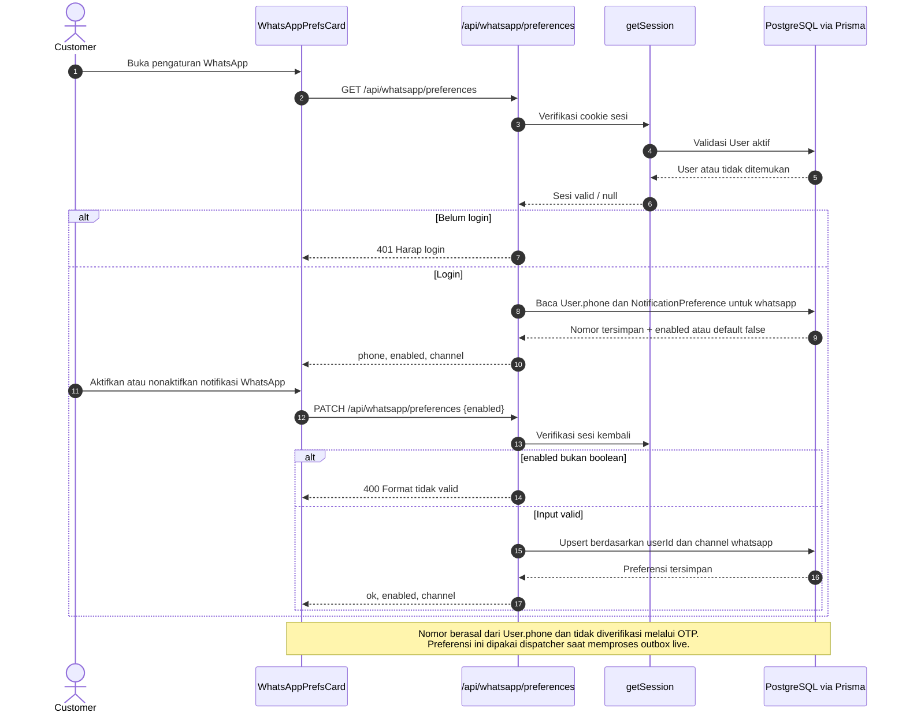

# 10. Customer Mengelola Preferensi WhatsApp

Status: final, berdasarkan audit source di `C:\laragon1\www\projek_rpl`.

```mermaid
sequenceDiagram
    autonumber
    actor C as Customer
    participant UI as WhatsAppPrefsCard
    participant API as /api/whatsapp/preferences
    participant Auth as getSession
    participant DB as PostgreSQL via Prisma

    C->>UI: Buka pengaturan WhatsApp
    UI->>API: GET /api/whatsapp/preferences
    API->>Auth: Verifikasi cookie sesi
    Auth->>DB: Validasi User aktif
    DB-->>Auth: User atau tidak ditemukan
    Auth-->>API: Sesi valid / null
    alt Belum login
        API-->>UI: 401 Harap login
    else Login
        API->>DB: Baca User.phone dan NotificationPreference untuk whatsapp
        DB-->>API: Nomor tersimpan + enabled atau default false
        API-->>UI: phone, enabled, channel
        C->>UI: Aktifkan atau nonaktifkan notifikasi WhatsApp
        UI->>API: PATCH /api/whatsapp/preferences {enabled}
        API->>Auth: Verifikasi sesi kembali
        alt enabled bukan boolean
            API-->>UI: 400 Format tidak valid
        else Input valid
            API->>DB: Upsert berdasarkan userId dan channel whatsapp
            DB-->>API: Preferensi tersimpan
            API-->>UI: ok, enabled, channel
        end
    end
    Note over UI,DB: Nomor berasal dari User.phone dan tidak diverifikasi melalui OTP.<br/>Preferensi ini dipakai dispatcher saat memproses outbox live.
```
